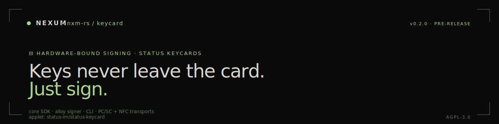

<p align="center">
  
</p>

# Nexum · keycard

A Rust toolkit for **Status Keycards** — smart cards that hold keys in a secure element and sign over an APDU channel. This workspace ships the core SDK, an Ethereum signer that plugs into [alloy](https://github.com/alloy-rs/alloy), and a CLI for hands-on card administration.

Nexum uses Keycards as a hardware-bound signing path for the [wallet](https://github.com/nxm-rs/wallet): the seed never leaves the card, the wallet talks to it over NFC on the phone or PC/SC on a desktop reader.

> Looking for the org overview? See **[github.com/nxm-rs](https://github.com/nxm-rs)**.

---

## Status

| | |
|---|---|
| Version | **0.2.0** · pre-release |
| MSRV | Rust 1.94 · edition 2024 |
| Transports | PC/SC (this repo) · NFC (see [nxm-rs/wallet](https://github.com/nxm-rs/wallet) `nexum-apdu-transport-nfc`) |
| Upstream applet | [status-im/status-keycard](https://github.com/status-im/status-keycard) |
| License | [AGPL-3.0-or-later](./LICENSE) |

> Pre-release. APIs may change. Not yet on crates.io.

---

## Crates

| Crate | What it is |
|---|---|
| **[`nexum-keycard`](./nexum-keycard)** | Core SDK: SELECT, INIT, pairing, secure channel, derive, sign |
| **[`nexum-keycard-signer`](./nexum-keycard-signer)** | `alloy::signers::Signer` implementation backed by a Keycard |
| **[`nexum-keycard-cli`](./nexum-keycard-cli)** | Command-line tool for initialisation, pairing, key derivation, signing |

Path note: **this repo was renamed** from `nexum-keycard` to `keycard` on 2026-05-29. GitHub redirects old URLs. Crate names (`nexum-keycard*`) are unchanged for now to keep `cargo add` working.

---

## Install

```bash
# Core SDK (when published):
cargo add nexum-keycard

# Ethereum signing:
cargo add nexum-keycard-signer

# CLI:
cargo install nexum-keycard-cli
```

Until the crates land on crates.io, depend by git rev:

```toml
nexum-keycard = { git = "https://github.com/nxm-rs/keycard", rev = "..." }
```

---

## Quickstart

```rust
use nexum_keycard::{Keycard, PcscDeviceManager, CardExecutor, Error};

fn main() -> Result<(), Error> {
    let manager   = PcscDeviceManager::new()?;
    let readers   = manager.list_readers()?;
    let reader    = readers.iter().find(|r| r.has_card()).expect("no card present");
    let transport = manager.open_reader(reader.name())?;

    let mut executor = CardExecutor::new_with_defaults(transport);
    let mut keycard  = Keycard::new(&mut executor);

    let info = keycard.select_keycard()?;
    println!("applet {} · instance {}", info.version, info.instance_uid);

    if !info.initialized() {
        let secrets = keycard.init(None, None, None)?;
        println!("PIN: {}\nPUK: {}\nPAIRING: {}",
                 secrets.pin(), secrets.puk(), secrets.pairing_password());
    }
    Ok(())
}
```

The CLI mirrors the SDK — see [`nexum-keycard-cli/README.md`](./nexum-keycard-cli/README.md) for command reference (init, pair, status, derive, sign).

---

## CLI cheatsheet

```bash
# Status / select
nexum-keycard-cli status

# Initialise a fresh card (prints PIN, PUK, pairing password ONCE)
nexum-keycard-cli init

# Pair a host (interactive password prompt)
nexum-keycard-cli pair

# Derive Ethereum address at m/44'/60'/0'/0/0
nexum-keycard-cli derive "m/44'/60'/0'/0/0"

# Sign a precomputed 32-byte digest
nexum-keycard-cli sign --digest 0x...
```

Pairing material persists on disk in a user-config dir; treat it as sensitive (anyone with it can talk to your card after PIN unlock).

---

## Embedding (the Nexum use case)

For mobile, the wallet uses a no-PC/SC build of this crate and supplies its own NFC transport in [`nxm-rs/wallet`](https://github.com/nxm-rs/wallet) under `rust/nexum-apdu-transport-nfc/`. If you target a non-PC/SC environment, gate the `pcsc` feature off and write a `CardTransport` over your channel.

---

## Repository layout

```
keycard/
├── nexum-keycard/         ← core SDK
│   └── src/
│       ├── application.rs       ← applet wrapper (SELECT, INIT, ...)
│       ├── commands/            ← per-instruction APDU builders
│       ├── crypto.rs            ← key derivation, hashing
│       ├── secure_channel.rs    ← pairing + SCP02-derived session
│       ├── session.rs           ← session state machine
│       ├── secrets.rs           ← PIN/PUK/pairing material
│       ├── validation.rs        ← input invariants
│       └── types/               ← typed responses
├── nexum-keycard-signer/  ← alloy Signer impl
├── nexum-keycard-cli/     ← interactive CLI
├── scripts/               ← release / changelog tooling
└── CHANGELOG.md           ← `git-cliff`-generated
```

---

## Contributing

Pre-release; APIs are still shifting. Open an issue before non-trivial PRs.

- **Rust** — `cargo fmt`, `cargo clippy -- -D warnings`. MSRV 1.94.
- **Commits** — Conventional Commits. Changelog generated by `git-cliff` from these.
- **DCO** — `Signed-off-by` line required on contributions.
- **No new deps** without a justification in the PR description. Smart-card code lives close to crypto — keep the attack surface small.

A CLA is in [`CLA.md`](./CLA.md) and tracked in [`nxm-rs/cla-signatures`](https://github.com/nxm-rs/cla-signatures).

## Security

See [SECURITY.md](https://github.com/nxm-rs/.github/blob/main/SECURITY.md) on the org `.github` repo. Findings in the secure-channel handshake, pairing persistence, or APDU framing are particularly high-value — please use GitHub Security Advisories on this repo for those.

## License

AGPL-3.0-or-later. See [LICENSE](./LICENSE).

```
●  AGPL-3.0  ·  pre-release  ·  hardware-bound signing
```
